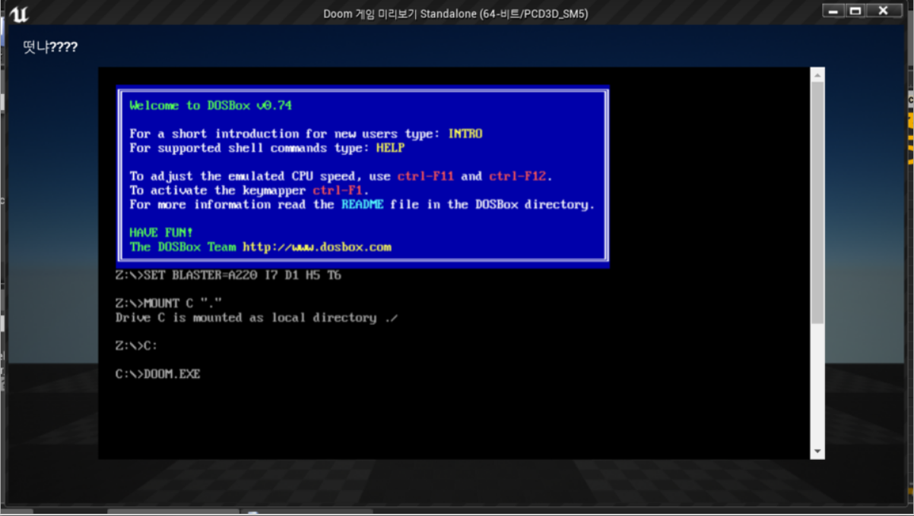

# UE4_Doom
UE4의 HUD 웹브라우저 위젯을 이용한 Doom 돌리기 프로젝트입니다.

## How to
[웹 브라우저 위젯](https://docs.unrealengine.com/ko/Engine/UMG/UserGuide/WidgetTypeReference/WebBrowser/index.html)은 게임화면 위의 인터페이스에 웹 페이지를 띄우는 역할을 수행합니다.  
이를 이용해서 웹 브라우저 위에 돌아가는 Doom을 연결하는 방법을 통해 구현했습니다.

## Screenshot

## 한계
웹 브라우저 위에서 돌아가는 .html파일을 위젯 시작URL에 직접 설정하면 작동하지 않기 때문에 링크를 한번 타고 접속해야 작동시킬 수 있습니다.  
아마 위젯이 정규표현식을 통해 확장자 파일들을 블로킹하는 것 같은데, 소스코드를 확인해보지는 않았습니다. 아마 기회가 되면 나중에...
